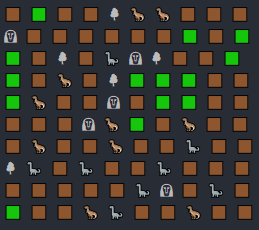

# Simulation
Creates a map of specified size with following objects:

- Static objects (`Tree`, `Grass`, `Rock`)
- `Herbivores`
- `Predators`

`Herbivores` look for `Grass` and consume it. \
`Predators` hunt `Herbivores` and kill them. \
`Tree` and `Rock` just fill cells of the map. They're not meant to be interacted with.
\
\
At each turn each creature (either `Herbivore` or `Predator`) can either move towards their respective target
or interact with it.

